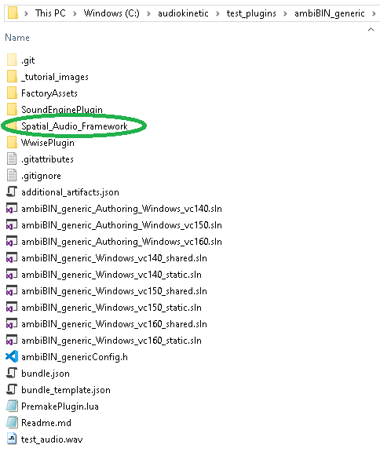

#  A Wwise plugin with Spatial Audio Framework (SAF) 

This tutorial is highly experimental and comes with no guarantees. It is currently not fully conforming to Wwise requirements and is Windows 10 specific, but can provide a starting point for tests and experiments with Spatial Audio Framework (SAF) integrated within a Wwise effect plugin. 

This builds a somewhat working Authoring plugin which can be tested in Wwise, but is not yet fully functional in Wwise Unity Integration (shared plugin).

The Authoring plugin has a generic Wwise GUI and the DSP functionality is similar to the **SPARTA** suite plugin **AmbiBIN** (without SOFA or OSC support).

For using the Wwise development tool scripts to create a blank effect template and building it, please refer to the other tutorial in this repository. It is highly recommended trying it first to learn about the development tool workflow, file structure and some other things that are not explained in detail in this tutorial. You are required to be fluent with those to be able to do any customizing or troubleshooting.

This tutorial assumes that you have the required development tools (Python, Microsoft Visual Studio and Wwise with Wwise SDK) already installed and you know your way around Wwise. If you are starting from scratch, please see the other tutorial first. This one continues from there, integrating Spatial Audio Framework to Wwise plugin.

The steps are as follows, they are explained in detail further below: 

- Dowload the Spatial Audio Framework code
- Download & install the chosen performance library
- Run a ready script to build&customize the performance library for SAF
- Download Wwise plugin code and move the compiled SAF folder inside it
- Run the premake and build scripts and open the plugin in Wwise

## Building and linking the dependencies for Spatial Audio framework (SAF)

First, the Spatial Audio Framework (SAF) needs to be built. Download the Spatial Audio Framework code from here:

https://github.com/leomccormack/Spatial_Audio_Framework

To build it, a performance library that supports CBLAS and LAPACK standards needs to be installed on your computer. The detailed instructions can be found here for different platforms and library options:

https://github.com/leomccormack/Spatial_Audio_Framework/blob/master/dependencies/PERFORMANCE_LIBRARY_INSTRUCTIONS.md

Build a chosen performance libaray for the project as described in the link above. See the options and decide what you need to use. The **Intel MKL** was used for this tutorial and the following steps describe how to install it. If you are using something else, build it with SAF accordingly and skip to the next step about building the actual Wwise plugin.

To install **Intel MKL**:

https://software.intel.com/content/www/us/en/develop/articles/free-ipsxe-tools-and-libraries.html

 (click "Download libraries now" -link, register, download and click the .exe to install)

Also note that if you have *Anaconda* installed, you might already have *Intel MKL* or be able easily add it:

*"Intel MKL also ships with recent Anaconda distributions. The easiest way to install with conda is":*

    conda install mkl mkl-include

The link below has some more details about how to install it using *conda*, or search online for current information to suit your specific needs:

https://software.intel.com/content/www/us/en/develop/articles/using-intel-distribution-for-python-with-anaconda.html

Once you are finished installing *Intel MKL*, change directory to the folder that has the *install-safmkl.bat script* (Spatial_Audio_Framework -root folder) and run it using the *"x64 Command Prompt for VS2019"* (use Windows search bar to find it). The following prompt should appear:

    ******************************************************************************************
    ************** Custom MKL library installer for the Spatial_Audio_Framework **************
    ******************************************************************************************

    This batch script will build the required saf_mkl_custom.lib and saf_mkl_custom.dll files
    and copy them into:
    - "Spatial_Audio_Framework/dependencies/Win64/lib/saf_mkl_custom.lib"
    - "C:/Windows/System32/saf_mkl_custom.dll".
    You may choose between sequential and threaded versions of the library. The latter option
    will also place libiomp5md.lib and libiomp5md.dll, in these same folders.

    NOTE: you will need to run this script using the "x64 Command Prompt for VS.exe", which
    will require Administrator privileges!

The script builds the required .lib and .dll files and places them to the correct folder. The linking and include commands mentioned in the "Performance Library instructions" -tutorial are already being taken care of in the *PremakePlugin.lua* script (covered later, included in the Wwise plugin root folder). 

Now you have the Spatial Audio Framework built and ready for use in  *Spatial_Audio_Framework* folder. You just need to move it inside your Wwise project folder as descibed in the next step.

You can find more info about the SAF in the Readme .md file in the *Spatial_Audio_Framework* root folder.

## Get the Wwise side code from GitHub and build the plugin project using Wwise SDK development tools

Next, download or clone the Wwise plugin project files from GitHub https://github.com/jannelehtimaki/ambiBIN_generic_without_SAF

Put these Wwise plugin project files to a desired location and then move the Spatial_Audio_Framework folder created in the previous step to the project root folder:

Use command promt (one you have access to Python with) to change directory to the ambiBIN_generic folder using cd C:\audiokinetic\test_plugins\AmbiBIN_generic. 

Then, while in that directory, locate the Wwise build tool scripts in the Wwise SDK folder structure (\Scripts\Build\Plugins\wp. py) and run the following scripts:

    python "C:\audiokinetic\Scripts\Build\Plugins\wp.py" premake Authoring
    python "C:\audiokinetic\Scripts\Build\Plugins\wp.py" premake Windows_vc160
    python "C:\audiokinetic\Scripts\Build\Plugins\wp.py" build Authoring -c Release -x x64_vc160
    python "C:\audiokinetic\Scripts\Build\Plugins\wp.py" build Windows_vc160 -c Debug

These should have now created all the .sln solution files to the root folder (premake) and the plugin builds (build) to the following folders (code formatting used for clarity):

**Authoring** build location:       
 
    C:\audiokinetic\Authoring\x64\Release\bin\Plugins (.dll, .pdb, .exp, .lib files)

**static** build location:

    C:\audiokinetic\SDK\x64_vc160\Debug\lib (.lib and .pdb files)

**shared** build location:

     C:\audiokinetic\SDK\x64_vc160\Debug\bin  (.dll, .exp, .ilk, .lib files))

Now after running these Premake and Build scripts you should be ready to test the plugin in the Wwise. When you make changes to the code you need to rebuild the project running the same script. The scripts build the required files directly to the folders that Wwise accesses when it looks for the available plugins, so *your_plugin_name* should show up in the drop down menu when adding an effect.

So add the test file *test_audio.wav* (included at Wwise project root folder) in Actor-mixer hierarchy, add a Master Audio bus to the Default Work Unit, double-click it and add your plugin and open it's GUI. Click the test sound file, set it to loop in General Settings tab and press play. Now by using headphones and adjusting the Yae and Roll sliders, you should hear the male and female voices panning around to somewhat opposite directions.

(The *test_audio.wav* is just a test file that has been processed with Sparta panner. You need to do the similar encoding for other audio files for the controls to have any effect)

## Customizing the build

More information how to use the Wwise development tools can be found here (or in the first part of the tutorial):

https://www.audiokinetic.com/library/edge/?source=SDK&id=effectplugin_tools.html

For the SoundEngine plugin-part, the required configuration depends on the target sound engine. For Wwise - Unity Integration, the static library needs to be linked with the shared part. This is currently done in the *ambiBIN_genericPlugin.cpp* file in *WwisePlugin* folder with the line AK_STATIC_LINK_PLUGIN(ambiBIN_genericFX). 

"FX" in the source file name (f.e. ambiBIN_generic**FX**Params.cpp) denotes it is an engine side file. This can be changed to something else in the *PremakePlugin.lua* script if desired.

 *PremakePlugin.lua* is the script where the Premake settings are declared. Adjust the file for custom settings for *static*, *shared* and *Authoring* setups. The changes in the .lua script reflect to the files included in the different project solutions (.sln files). For example, if you include something (for example a .h or .cpp file ) in the shared section of the .lua script, it shows up in the file structure of the related Visual Studio solution file *your_project_Windows_vc160_shared.sln*.

Premaking and building the *Authoring* and *Windows_vc160* options from the command line currently compiles all 3 versions (Shared, Static and Authoring). Again the required settings depend on for which setup you are compiling for and how the .lua script is set up. You can customize it to your needs.

## Final note

This tutorial is provided AS-IS with no support or guarantees. However it can potentially save a lot of time for a developer who is just getting started and wants to get an overview of how to get SAF running. 

As mentioned in the start, this plugin seems to work in the Authoring side but not yet in Unity Integration (shared .dll). It gets generated in soundbanks but somehow seems to get a wrong ID from Wwise that isn't recognized on Unity side. This might be a somewhat simple fix when found.

The parameter and memory management needs to be properly implemented, now they are not yet properly handled. Also, the linking of the shared library maybe needs to be more looked into. (Wwise and SAF handle booleans as integers so there can be something wrong with that between the source files and the .xml, and the dynamic memory needs to be allocated properly. The linking for shared plugin is now done with AK_STATIC_LINK_PLUGIN(ambiBIN_genericFX) at *ambiBIN_genericPlugin.cpp* which may or may not be the best option and so on).

The bottom line when doing the implementation is that you cannot just hack around trying some shortcuts that happen work for your use case or specific setting, you must follow the Wwise way of doing things very strictly. There are a lot of things related to parameter and soundbank loading and saving and the dynamic memory management that need to be exactly right to work in all situations.

Please refer to the following guides and the rest of the Wwise SDK documentation for further information.

How to Create Wwise Sound Engine Plug-ins:

 *(Creating Wwise sound engine plug-ins is empowering, but it can be complex. We strongly recommend that you read through the following sections in tandem with the samples we provide in the Sample Plug-ins section. Our samples offer a reliable style and structure for the basis of your own creations.)*

(note however that the sample projects in the SDK do not seem to have no .lua scripts that the recent build tools use. There are obsolete, incorrect and ambiguous things and guidelines here and there in the SDK documentation):

https://www.audiokinetic.com/library/2019.1.10_7250/?source=SDK&id=soundengine_plugins.html

Testing your plugin:

https://www.audiokinetic.com/library/2019.1.10_7250/?source=SDK&id=plugin_tests.html

Troubleshooting (see especially the Unity section on the bottom of the page):

https://www.audiokinetic.com/library/2019.1.10_7250/?source=SDK&id=plugin_troubleshooting.html

 

